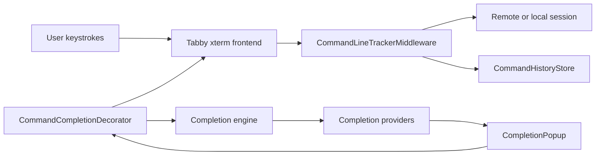

# Architecture

The plugin intentionally lives outside the remote shell. It observes terminal input, keeps local state, and inserts accepted completion text back into the terminal.

## Data Flow

## Provider Model

The completion engine should merge candidates from providers:

- history provider;
- template provider;
- static command rule provider;
- optional probe provider.

Candidates should carry a source, replacement range, display text, insertion text, description, confidence, recency, and frequency. The engine should rank candidates consistently instead of letting each provider fight for UI priority.

## Parsing Model

The parser should be a tolerant shell lexer, not a full Bash interpreter. It should understand:

- quotes;
- escapes;
- pipes;
- `;`, `&&`, and `||`;
- current command segment;
- current token and token boundaries.

The first stable version may only complete at the end of the line. Mid-line replacement should be added after the parser has tests.

## Storage Model

The MVP uses Tabby config for history. Long term, history should move to a dedicated store such as JSONL or SQLite to avoid bloating `config.yaml`.

Storage keys should include:

- profile id;
- host;
- user;
- system class;
- optionally working directory.

Commands should not be stored when they match privacy filters or begin with a space.
